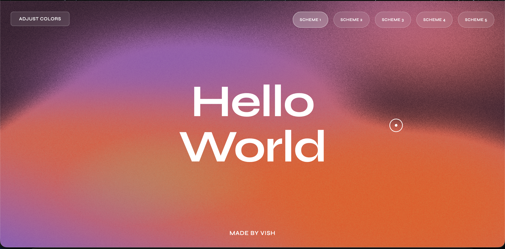

# Hello World - Interactive Liquid Gradient

An interactive webpage featuring a dynamic liquid gradient background with customizable color schemes.

## 🌐 Live Demo

**[View Live Site](https://vish-p0.github.io/Hello_world/)**

## 📸 Preview



## ✨ Features

- Interactive liquid gradient background using Three.js & WebGL
- 5 customizable color schemes
- Real-time color adjustment panel
- Mouse/touch ripple effects
- Custom animated cursor

## 🛠️ Setup Steps

### 1. Create Project Directory
```bash
mkdir git-practical-1
cd git-practical-1
```

### 2. Create HTML File
```bash
touch HelloWorld.html
```

### 3. Initialize Git Repository
```bash
git init
```

### 4. Stage and Commit
```bash
git add .
git commit -m "Initial commit - Hello World with liquid gradient"
```

### 5. Create GitHub Repository
- Go to GitHub and create a new repository named `Hello_world`

### 6. Connect Remote & Push
```bash
git remote add origin https://github.com/Vish-p0/Hello_world.git
git branch -M main
git push -u origin main
```

### 7. Enable GitHub Pages
- Go to repository **Settings** → **Pages**
- Select **main** branch as source
- Save and wait for deployment

## 👤 Author

**Made by Vish**

---

*PAF Lab Practical 1 - Version Controlling with Git*
